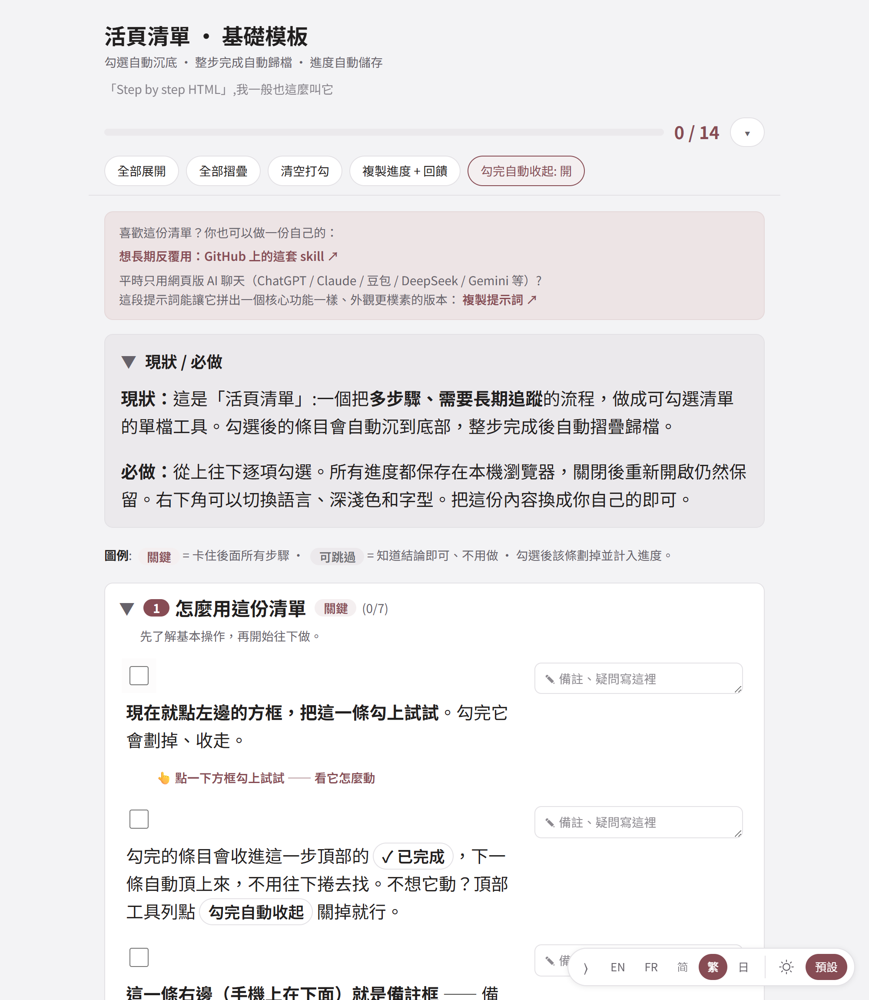

# 活頁清單

[English](README.md) · [Français](README.fr.md) · [简体中文](README.zh.md) · **繁體中文** · [日本語](README.ja.md)

[](https://github.com/MtsYama/living-checklist/stargazers)

> **覺得有用？** 給個 ⭐ Star 是對我最大的鼓勵，也歡迎分享 / 推薦給可能需要的人。
> 關注我：[GitHub @MtsYama](https://github.com/MtsYama) · [領英 LinkedIn](https://www.linkedin.com/in/zhengshen-shu/)

> **點開就能試（不用裝任何東西）：** https://mtsyama.github.io/living-checklist/


*勾一條它就收起，做完一整步卡片就折疊——全程自動存在瀏覽器裡。*

## 安裝（一次貼上）

用 Claude Code 的話，把這個 repo 當 plugin marketplace 加進去，再裝 skill：

```
/plugin marketplace add MtsYama/living-checklist
/plugin install living-checklist@living-checklist
```

然後要麼跑 `/living-checklist:living-checklist`，要麼直接跟 AI 說「給我做一份關於 X 的清單」——它會幫你把模板填好。

不用 Claude Code？還有兩種走法：把 repo clone 到 `~/.claude/skills/living-checklist/`，或者乾脆不裝，[把 prompt 複製](#三種用法)到任意網頁 AI 聊天裡。詳見下面[三種用法](#三種用法)。

## 搭配其它工具 / 模型用

它不綁定 Claude。`SKILL.md` 就是一份任何工具都能讀的普通 markdown，所以有兩條路。

**模式 A——程式碼（CLI / 編輯器裡的 AI agent）。** 把 repo clone 下來，讓工具指向 `SKILL.md`。其中幾款支援一行指令裝好：

| 工具 | 安裝 / 用法 |
|---|---|
| Claude Code | `/plugin marketplace add MtsYama/living-checklist`，再 `/plugin install living-checklist@living-checklist` |
| OpenAI Codex CLI | `$skill-installer install https://github.com/MtsYama/living-checklist`（Codex 原生讀 `SKILL.md`） |
| GitHub Copilot | `gh skill install MtsYama/living-checklist`（原生支援 `SKILL.md`） |
| Gemini CLI | `gemini extensions install https://github.com/MtsYama/living-checklist` |
| Cursor | clone → 把 `SKILL.md` 的內容放進 `.cursor/rules/living-checklist.mdc`，並引用 `@templates/base.html` |
| Windsurf | clone → 把 `SKILL.md` 內容放進 `.windsurf/rules/living-checklist.md` |
| Cline / Roo | clone → 把 `SKILL.md` 內容放進 `.clinerules` |
| Aider | clone → `aider --read SKILL.md templates/base.html` |

**模式 B——聊天（任意聊天機器人，啥都不用裝）。** 打開任意一份清單，點「複製這段提示詞」，連同你自己的資料一起貼進任意 AI 對話，它就會回傳一個完整的單 HTML 檔案。把它存成 `something.html`，雙擊打開即可。ChatGPT（Canvas）、Claude（Artifacts）、Gemini（Canvas）都能用，會就地內嵌預覽；輸出特別長時可能被截斷，跟它說一句「繼續」就行。

**中文模型（聊天模式）。** 豆包 / 通义千问 / 腾讯元宝 / 智谱清言（GLM）都會輸出完整 HTML *並且*就地內嵌預覽。Kimi 透過一個部署連結預覽。DeepSeek / 文心一言 / 讯飞星火 會輸出 HTML 但沒有內嵌預覽（存成 `.html` 雙擊打開），且長 HTML 可能被截斷——讓它「繼續」，或分幾段生成。

**通用兜底（任何模型）。** 不管哪個模型給你的 HTML——把程式碼複製下來，存成 `name.html`，雙擊。零依賴，離線也能跑。


「Step by step HTML」，我一般也這麼叫它。

一份「活的」、分步驟的清單引擎，整個就是**一個 HTML 檔案**。雙擊打開就能用，沒有建置、沒有伺服器、不連網也能跑。

勾掉一條，它會平滑地收進這一步頂部的「✓ 已完成」分組；整步做完，卡片會掛上「✓ 已完成」徽標、就地摺疊起來（不會被挪到頁面底部）。進度自動存在瀏覽器裡，關掉再打開還在。

**這是什麼（不是什麼）。** 它不是一個裝上就能用的成品 app，而是一種用 AI、或者手動產生一份「活的」清單的方式：把需求說給 AI（ChatGPT、Claude 這些），或者自己改一下檔案，它就產出一個 HTML 檔案，雙擊就能用。工具本身不帶 AI，靠你自己的 AI 來把清單產生出來。後面也許會長成一個能對接 Notion 那類工具的獨立 app，但現在還沒有；今天它就是這一個檔案加一個 Claude skill。

**適合誰。** 已經習慣用 AI、喜歡用清單、想讓 AI 常幫你拉一份的人；或者覺得現有清單工具用著不太順手、想試點別的的人。暫時還不適合想要一個裝上就能用、且開箱即對接 Notion 的成品 app 的人。

## 截圖

| Base · 黛藍（淺色） | Base · 酒紅（淺色） |
|---|---|
|  |  |
| **MX Studio（深色）** | **完整例子** |
|  |  |

預設模板提供兩種乾淨配色——**黛藍 / Lapis blue**（預設）和**酒紅 / Burgundy**——外加一套 **MX Studio** 暗色設計師皮。

## 快速上手

1. 下載 `templates/base.html`（或 `mx-studio.html`）。
2. 用文字編輯器打開，找到 `[1] DATA` 和 `[2] CONFIG` 兩段，按裡面的註解錨點填你自己的內容。
3. 儲存，雙擊打開。開始勾。

不想手填？把模板 + 你的需求丟給 AI，讓它替你填（見下面的「三種用法」）。

**瀏覽器支援。** 任何現代瀏覽器（Chrome / Edge / Firefox / Safari）都行。進度存在該瀏覽器的 `localStorage` 裡，所以同一份檔案在同一個瀏覽器裡再打開，進度還在；換瀏覽器或換裝置不會同步。

## 這是什麼

- **勾掉的條目自動收起**——FLIP 動畫把做完的條目平滑收進本步頂部的「✓ 已完成」分組，剩下要做的留在眼前。（不想它動？工具列點「勾完自動收起」關掉就行。）
- **整步就地摺疊**——一步裡的條目全勾完，整張卡片掛上「✓ 已完成」徽標、就地摺疊，不會被挪到頁面底部。
- **每條目各帶備註**——每個條目各有一個備註框。記個想法、一個問題、一個回頭要填的值；自動儲存，複製進度時一起帶走。
- **巢狀子清單**——任意條目下都能展開一層更細的子清單，某一條需要單獨拆開時用。
- **一次性新手引導**（只在模板裡）：輕輕領你走完第一次勾選、寫備註、複製進度，不看說明也能上手。
- **頂部總進度條**——跨所有步驟追蹤完成度。
- **全部自動儲存**到 `localStorage`。關掉再打開，勾選 / 摺疊 / 備註原樣都在。
- **可摺疊工具列**（頂部）：全部展開 · 全部摺疊 · 重設勾選 · 勾完自動收起 · **複製進度 + 回饋**（把目前進度和每條備註打包成 markdown 放到剪貼簿，貼回 AI 對話裡就能驅動下一輪迭代）。
- **右下角浮動控制項**：語言切換（只列出這份清單實際提供的語言）、主題三態（自動 / 淺色 / 深色，「自動」時按鈕上有個小小的「A」角標）、字型切換（Noto / 系統字型）。
- **連結一律新開分頁**，點參考連結不會把清單頁跳走、丟掉進度。
- **內建 5 種語言**：简体中文、繁體中文、English、Français、日本語。資料按 locale 分鍵。
- **無障礙**：正文 18px 起，鍵盤可達，focus 有可見的聚焦環，ARIA 進度條 + live region，摺疊對螢幕閱讀器正確，尊重 `prefers-reduced-motion`。

## 三種用法

**1. 自己動手改。** 複製一份模板，改裡面的 `[1] DATA` 和 `[2] CONFIG` 兩段，打開檔案。不用建置。

**2. 當 Claude skill 用（這個 repo 本身就是 skill）。** 在 Claude Code 裡最快的方式是一次貼上裝好：

```
/plugin marketplace add MtsYama/living-checklist
/plugin install living-checklist@living-checklist
```

然後跑 `/living-checklist:living-checklist`，或者直接跟你的 AI 說「給我做一份關於 X 的清單」，它會幫你把模板填好。不想走 marketplace？也可以把 repo 直接 clone 到 `~/.claude/skills/living-checklist/`——根目錄的 `SKILL.md` + `templates/` 就是這個 skill 的全部。

**3. 純聊天（沒有命令列也行）。** 打開任意一份清單，點頂部橫幅裡的「複製這段提示詞」按鈕，貼到任意網頁版 AI 對話裡（ChatGPT / Claude / Gemini 等），它會產生一份簡單的清單 HTML。

## 一個完整例子

`examples/` 裡放了一個走通的例子，演示這個工具的全部意義：把一段亂糟糟、口述的需求變成有條理、按時間排好、可勾選的計劃。

- **輸入** → `examples/europe-japan-trip-prompt.md`
- **結果** → `examples/europe-japan-trip.html`（base 模板）和 `examples/europe-japan-trip-mx.html`（mx 模板）

輸入是一段語音口述、亂糟糟的旅行需求（「7 月 15 號到 8 月 15 號休假，想去法國 + 義大利 + 日本，中國護照，吃的很挑，想挑個人少的日子去羅浮宮……」）。

由它產出一份有 **7 個模組** 的結構化計劃：簽證、機票、住宿、吃、博物館 / 展覽、禮物、出發前。它還會「按上下文產生」：

- 2 張已經訂好的機票**預先勾上**。
- 身分資訊從已知內容**預先填好**（範例 John Doe）。
- 不確定的欄位——護照號、回程機票、簽證細節——留成提示性的**佔位符**，讓計劃直接告訴你還缺什麼。

這就是那個循環：亂糟糟的輸入進去，有條理的計劃出來，你照著一條條勾。

## 自訂 / 做你自己的皮

同一套引擎，上面套幾張皮——預設模板的兩種配色，外加一套設計師皮。模板都在 `templates/` 下。

| 模板 | 風格 | 字型 | 預設主題 |
|---|---|---|---|
| `base.html` | 乾淨的行事曆 App 風，淺色、克制——**黛藍 / Lapis blue** 點綴（預設） | 系統黑體 / Noto | 自動 |
| `base-burgundy.html` | 同一套乾淨預設模板，換成暖調的**酒紅 / Burgundy** | 系統黑體 / Noto | 自動 |
| `mx-studio.html` | 深色 noir + 金色，襯線、editorial，大號 folio 步驟編號，Phosphor 圖示 | Cormorant Garamond + Alegreya + 霞鶩文楷 + IBM Plex Mono | 深色 |

要做你自己的皮，複製一份模板，改頂部的 CSS 變數（顏色、字型、間距）。資料和引擎不動，所以你可以隨意改樣式而不破壞任何行為。黛藍和酒紅兩個檔案就是這麼來的：同一套 base 模板，換一個點綴色。想要一個已經有態度的起點，就 fork `mx-studio.html` 再換調色盤。

## 倉庫結構

```
living-checklist/
  README.md          英文說明
  README.zh.md       簡體中文說明
  LICENSE            MIT
  SKILL.md           Claude skill 定義（這個 repo 本身就是 skill）
  templates/
    base.html        乾淨淺色預設模板（黛藍點綴）
    base-burgundy.html 同款預設模板（酒紅點綴）
    mx-studio.html   noir 設計師皮（深色 / 金）
  examples/
    europe-japan-trip.html       走通的例子（base）
    europe-japan-trip-mx.html     走通的例子（mx）
    europe-japan-trip-prompt.md   對應的輸入需求
  assets/            各語言截圖（base / MX / example × en·fr·簡·繁·日）
```

## 協議

MIT，見 [LICENSE](LICENSE)。可商用。Fork 它、拿它做的東西去賣，都沒問題。

所有字型都透過 Google Fonts 引入，授權為 OFL 或 MIT，沒有任何禁止商用的字型。

## 作者

Mts Yama（[@MtsYama](https://github.com/MtsYama)）· [github.com/MtsYama/living-checklist](https://github.com/MtsYama/living-checklist)

字型：Noto、Cormorant Garamond、Alegreya、霞鶩文楷、IBM Plex Mono（都透過 Google Fonts 引入）。MX 皮裡的圖示來自 [Phosphor](https://phosphoricons.com/)。
