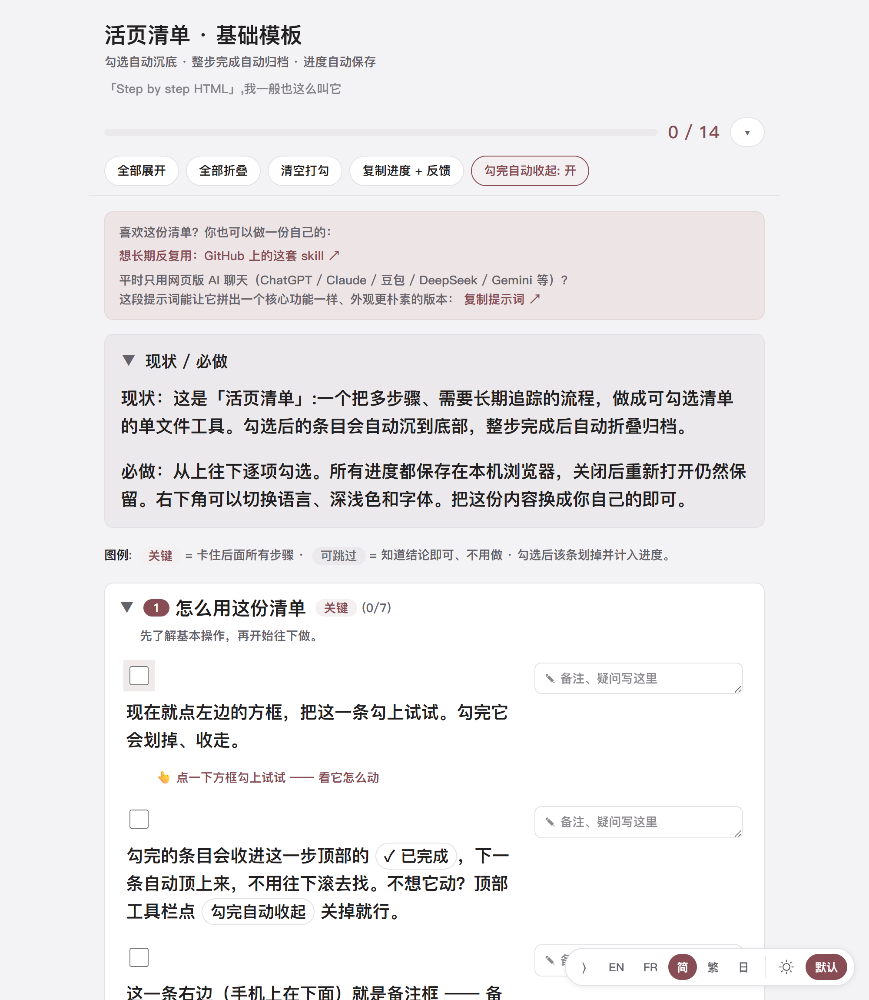

# 活页清单

[English](README.md) · [Français](README.fr.md) · **简体中文** · [繁體中文](README.zh-Hant.md) · [日本語](README.ja.md)

[](https://github.com/MtsYama/living-checklist/stargazers)

> **觉得有用？** 给个 ⭐ Star 是对我最大的鼓励，也欢迎分享 / 推荐给可能需要的人。
> 关注我：[GitHub @MtsYama](https://github.com/MtsYama) · [领英 LinkedIn](https://www.linkedin.com/in/zhengshen-shu/)

> **点开就能试(不用装任何东西):** https://mtsyama.github.io/living-checklist/

## 安装(一次粘贴)

用 Claude Code 的话,把这个 repo 当 plugin marketplace 加进去,再装 skill:

```
/plugin marketplace add MtsYama/living-checklist
/plugin install living-checklist@living-checklist
```

然后要么跑 `/living-checklist:living-checklist`,要么直接跟 AI 说「给我做一份关于 X 的清单」——它会帮你把模板填好。

不用 Claude Code?还有两种走法:把 repo clone 到 `~/.claude/skills/living-checklist/`,或者干脆不装,[把 prompt 复制](#三种用法)到任意网页 AI 聊天里。详见下面[三种用法](#三种用法)。

## 配合其它工具 / 模型用

它不绑定 Claude。`SKILL.md` 就是一份任何工具都能读的普通 markdown,所以有两条路。

**模式 A——代码(CLI / 编辑器里的 AI agent)。** 把 repo clone 下来,让工具指向 `SKILL.md`。其中几款支持一行命令装好:

| 工具 | 安装 / 用法 |
|---|---|
| Claude Code | `/plugin marketplace add MtsYama/living-checklist`,再 `/plugin install living-checklist@living-checklist` |
| OpenAI Codex CLI | `$skill-installer install https://github.com/MtsYama/living-checklist`(Codex 原生读 `SKILL.md`) |
| GitHub Copilot | `gh skill install MtsYama/living-checklist`(原生支持 `SKILL.md`) |
| Gemini CLI | `gemini extensions install https://github.com/MtsYama/living-checklist` |
| Cursor | clone → 把 `SKILL.md` 的内容放进 `.cursor/rules/living-checklist.mdc`,并引用 `@templates/base.html` |
| Windsurf | clone → 把 `SKILL.md` 内容放进 `.windsurf/rules/living-checklist.md` |
| Cline / Roo | clone → 把 `SKILL.md` 内容放进 `.clinerules` |
| Aider | clone → `aider --read SKILL.md templates/base.html` |

**模式 B——聊天(任意聊天机器人,啥都不用装)。** 打开任意一份清单,点「复制这段提示词」,连同你自己的数据一起粘进任意 AI 对话,它就会返回一个完整的单 HTML 文件。把它存成 `something.html`,双击打开即可。ChatGPT(Canvas)、Claude(Artifacts)、Gemini(Canvas)都能用,会就地内嵌预览;输出特别长时可能被截断,跟它说一句「继续」就行。

**中文模型(聊天模式)。** 豆包 / 通义千问 / 腾讯元宝 / 智谱清言(GLM)都会输出完整 HTML *并且*就地内嵌预览。Kimi 通过一个部署链接预览。DeepSeek / 文心一言 / 讯飞星火 会输出 HTML 但没有内嵌预览(存成 `.html` 双击打开),且长 HTML 可能被截断——让它「继续」,或分几段生成。

**通用兜底(任何模型)。** 不管哪个模型给你的 HTML——把代码复制下来,存成 `name.html`,双击。零依赖,离线也能跑。


「Step by step HTML」,我一般也这么叫它。

一份「活的」、分步骤的清单引擎，整个就是**一个 HTML 文件**。双击打开就能用，没有构建、没有服务器、不联网也能跑。

勾掉一条，它会平滑地收进这一步顶部的「✓ 已完成」分组；整步做完，卡片会挂上「✓ 已完成」徽标、就地折叠起来（不会被挪到页面底部）。进度自动存在浏览器里，关掉再打开还在。

**这是什么(不是什么)。** 它不是一个装上就能用的成品 app,而是一种用 AI、或者手动生成一份「活的」清单的方式:把需求说给 AI(ChatGPT、Claude 这些),或者自己改一下文件,它就产出一个 HTML 文件,双击就能用。工具本身不带 AI,靠你自己的 AI 来把清单生成出来。后面也许会长成一个能对接 Notion 那类工具的独立 app,但现在还没有;今天它就是这一个文件加一个 Claude skill。

**适合谁。** 已经习惯用 AI、喜欢用清单、想让 AI 常帮你拉一份的人;或者觉得现有清单工具用着不太顺手、想试点别的的人。暂时还不适合想要一个装上就能用、且开箱即对接 Notion 的成品 app 的人。

## 截图

| Base · 黛蓝(浅色) | Base · 酒红(浅色) |
|---|---|
|  |  |
| **MX Studio(深色)** | **完整例子** |
|  |  |

默认模板提供两种干净配色——**黛蓝 / Lapis blue**（默认）和**酒红 / Burgundy**——外加一套 **MX Studio** 暗色设计师皮。

## 快速上手

1. 下载 `templates/base.html`（或 `mx-studio.html`）。
2. 用文本编辑器打开，找到 `[1] DATA` 和 `[2] CONFIG` 两段，按里面的注释锚点填你自己的内容。
3. 保存，双击打开。开始勾。

不想手填？把模板 + 你的需求丢给 AI，让它替你填（见下面的「三种用法」）。

**浏览器支持。** 任何现代浏览器（Chrome / Edge / Firefox / Safari）都行。进度存在该浏览器的 `localStorage` 里，所以同一份文件在同一个浏览器里再打开，进度还在；换浏览器或换设备不会同步。

## 这是什么

- **勾掉的条目自动收起**——FLIP 动画把做完的条目平滑收进本步顶部的「✓ 已完成」分组，剩下要做的留在眼前。（不想它动？工具栏点「勾完自动收起」关掉就行。）
- **整步就地折叠**——一步里的条目全勾完，整张卡片挂上「✓ 已完成」徽标、就地折叠，不会被挪到页面底部。
- **每条目各带备注**——每个条目各有一个备注框。记个想法、一个问题、一个回头要填的值;自动保存,复制进度时一起带走。
- **嵌套子清单**——任意条目下都能展开一层更细的子清单，某一条需要单独拆开时用。
- **一次性新手引导**（只在模板里）：轻轻领你走完第一次勾选、写备注、复制进度，不看说明也能上手。
- **顶部总进度条**——跨所有步骤追踪完成度。
- **全部自动保存**到 `localStorage`。关掉再打开，勾选 / 折叠 / 备注原样都在。
- **可折叠工具栏**（顶部）：全部展开 · 全部折叠 · 重置勾选 · 勾完自动收起 · **复制进度 + 反馈**（把当前进度和每条备注打包成 markdown 放到剪贴板，粘回 AI 对话里就能驱动下一轮迭代）。
- **右下角浮动控件**：语言切换（只列出这份清单实际提供的语言）、主题三态（自动 / 浅色 / 深色，「自动」时按钮上有个小小的「A」角标）、字体切换（Noto / 系统字体）。
- **链接一律新开标签页**，点参考链接不会把清单页跳走、丢掉进度。
- **内置 5 种语言**：简体中文、繁體中文、English、Français、日本語。数据按 locale 分键。
- **无障碍**：正文 18px 起，键盘可达，focus 有可见的聚焦环，ARIA 进度条 + live region，折叠对屏幕阅读器正确，尊重 `prefers-reduced-motion`。

## 三种用法

**1. 当人手动用。** 复制一份模板，改里面的 `[1] DATA` 和 `[2] CONFIG` 两段，打开文件。不用构建。

**2. 当 Claude skill 用（这个 repo 本身就是 skill）。** 在 Claude Code 里最快的方式是一次粘贴装上：

```
/plugin marketplace add MtsYama/living-checklist
/plugin install living-checklist@living-checklist
```

然后跑 `/living-checklist:living-checklist`，或者直接跟你的 AI 说「给我做一份关于 X 的清单」，它会帮你把模板填好。不想走 marketplace？也可以把 repo 直接 clone 到 `~/.claude/skills/living-checklist/`——根目录的 `SKILL.md` + `templates/` 就是这个 skill 的全部。

**3. 纯聊天（没有命令行也行）。** 打开任意一份清单，点顶部横幅里的「复制这段提示词」按钮，粘到任意网页版 AI 对话里（ChatGPT / Claude / Gemini 等），它会生成一份简单的清单 HTML。

## 一个完整例子

`examples/` 里放了一个走通的例子,演示这个工具的全部意义:把一段乱糟糟、口述的需求变成有条理、按时间排好、可勾选的计划。

- **输入** → `examples/europe-japan-trip-prompt.md`
- **结果** → `examples/europe-japan-trip.html`（base 模板）和 `examples/europe-japan-trip-mx.html`（mx 模板）

输入是一段语音口述、乱糟糟的旅行需求（「7 月 15 号到 8 月 15 号休假，想去法国 + 意大利 + 日本，中国护照，吃的很挑，想挑个人少的日子去卢浮宫……」）。

由它产出一份有 **7 个模块** 的结构化计划：签证、机票、住宿、吃、博物馆 / 展览、礼物、出发前。它还会「按上下文生成」：

- 2 张已经订好的机票**预先勾上**。
- 身份信息从已知内容**预先填好**（示例 John Doe）。
- 不确定的字段——护照号、回程机票、签证细节——留成提示性的**占位符**，让计划直接告诉你还缺什么。

这就是那个循环：乱糟糟的输入进去，有条理的计划出来，你照着一条条勾。

## 自定义 / 做你自己的皮

同一套引擎，上面套几张皮——默认模板的两种配色，外加一套设计师皮。模板都在 `templates/` 下。

| 模板 | 风格 | 字体 | 默认主题 |
|---|---|---|---|
| `base.html` | 干净的日历 App 风，浅色、克制——**黛蓝 / Lapis blue** 点缀（默认） | 系统黑体 / Noto | 自动 |
| `base-burgundy.html` | 同一套干净默认模板，换成暖调的**酒红 / Burgundy** | 系统黑体 / Noto | 自动 |
| `mx-studio.html` | 深色 noir + 金色，衬线、editorial，大号 folio 步骤编号，Phosphor 图标 | Cormorant Garamond + Alegreya + 霞鹜文楷 + IBM Plex Mono | 深色 |

要做你自己的皮，复制一份模板，改顶部的 CSS 变量（颜色、字体、间距）。数据和引擎不动，所以你可以随意改样式而不破坏任何行为。黛蓝和酒红两个文件就是这么来的：同一套 base 模板，换一个点缀色。想要一个已经有态度的起点，就 fork `mx-studio.html` 再换调色板。

## 仓库结构

```
living-checklist/
  README.md          英文说明
  README.zh.md       简体中文说明
  LICENSE            MIT
  SKILL.md           Claude skill 定义（这个 repo 本身就是 skill）
  templates/
    base.html        干净浅色默认模板（黛蓝点缀）
    base-burgundy.html 同款默认模板（酒红点缀）
    mx-studio.html   noir 设计师皮（深色 / 金）
  examples/
    europe-japan-trip.html       走通的例子（base）
    europe-japan-trip-mx.html     走通的例子（mx）
    europe-japan-trip-prompt.md   对应的输入需求
  assets/            各语言截图（base / MX / example × en·fr·简·繁·日）
```

## 协议

MIT，见 [LICENSE](LICENSE)。可商用。Fork 它、拿它做的东西去卖，都没问题。

所有字体都通过 Google Fonts 引入，授权为 OFL 或 MIT，没有任何禁止商用的字体。

## 作者

Mts Yama（[@MtsYama](https://github.com/MtsYama)）· [github.com/MtsYama/living-checklist](https://github.com/MtsYama/living-checklist)

字体：Noto、Cormorant Garamond、Alegreya、霞鹜文楷、IBM Plex Mono（都通过 Google Fonts 引入）。MX 皮里的图标来自 [Phosphor](https://phosphoricons.com/)。
